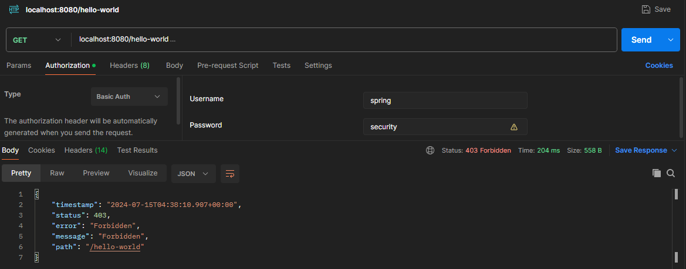

# Spring Framework

This learning project, inspired by the Udemy course [Master Spring Boot 3 & Spring Framework 6 with Java](https://www.udemy.com/course/spring-boot-and-spring-framework-tutorial-for-beginners/), was developed using Spring Security.

### Prerequisites

To use this project, you need to have knowledge of:

+ Java - Object Oriented Programming Language.
+ Spring Boot - Create stand-alone Spring applications.
+ Spring Security - Customizable authentication and access-control framework
+ Postman - API testing platform.

### Installing the Project

To download this project, run the following command down below.

```
git clone https://github.com/JuanPablo70/SpringSecurity.git
```

### About this Project

This repository contains a series of commits that demonstrate the security of a project using Spring Security. Each commit introduces key web security concepts to strengthen the application's protection.

+ **Basic Authentication commit:** Basic authentication is implemented by adding an Authorization header with the value ```Basic [Base64 username:password]```. This approach is not recommended because it is easy to decode the header, and it does not expire.

    

+ **CSRF for REST API commit:** Protection against CSRF attacks is implemented using the synchronizer token pattern. The endpoint ```/csrf-token``` is created, as POST and PUT requests require a CSRF token obtained from the previous request.

    

    

+ **Security Configuration to Disable CSRF commit:** For stateless APIs, CSRF should be disabled. A configuration class ```BasicAuthSecurityConfiguration``` is created with the ```@Configuration``` annotation and a ```@Bean``` ```securityFilterChain``` that overrides the default Spring Security configuration. In this bean, ```http.csrf(AbstractHttpConfigurer::disable);``` is included to disable CSRF.

+ **User Credentials in Memory commit:** In the configuration class created in the previous commit, ```userDetailsService``` bean is added to create credentials in memory. This is a better approach than having them in the application.properties file.

+ **User Credentials Using JDBC commit:** Frames are enabled to view the H2 console. ```datasource``` bean is created to generate the Users and Authorities tables in H2 when the project is executed. The ```userDetailsService``` is modified to insert credentials into the H2 datasource.

    

    

+ **Bcrypt Encoded Passwords Stored commit:** ```passwordEncoder``` bean is created in the configuration file to generate a hash of user passwords and insert them into the datasource, thus avoiding having plain text passwords.

    

+ **JWT Auth with Spring Security and Spring Boot commit:** A new configuration class for JWT ```JwtSecurityConfiguration``` is created from ```BasicAuthSecurityConfiguration``` (that must be disabled), which enables OAuth2 class. The steps include:

  1. Create a key pair with KeyPairGenerator and the RSA algorithm.
  
  2. Create an RSAKey object by injecting the created key pair.
  
  3. Create a JWKSource (JSON Web Key Source) by injecting the created RSA key.
  
  4. Use the RSA public key to decode the JWT.

+ **JWT Controller commit:** An encoder is added in the JWT configuration class. Additionally, a controller is created to generate the JWT token by sending username and password, including the associated roles using the ```createScope``` method. To make requests, the Authorization header with the value ```Bearer [JWT generated with the /authenticate endpoint]``` must be included.

    

    

    

+ **Spring Security Authorization commit:** Forms of authorization in Spring Security are demonstrated. One way is to configure it in the configuration class to validate that certain requests can only be made by certain roles. Another way is to use the ```@PreAuthorize```, ```@PostAuthorize```, or ```@RolesAllowed``` annotations as shown in the Todo controller.

    

### Build With

+ [Spring Initializr](https://start.spring.io) - Tool used to set up Spring Boot projects.
+ [Gradle](https://gradle.org) - Accelerates developer productivity.
+ [JWT](https://jwt.io) - Allows you to decode, verify and generate JWT.

### Version

1.0

### Author

[Juan Pablo Sánchez Bermúdez](https://github.com/JuanPablo70)

